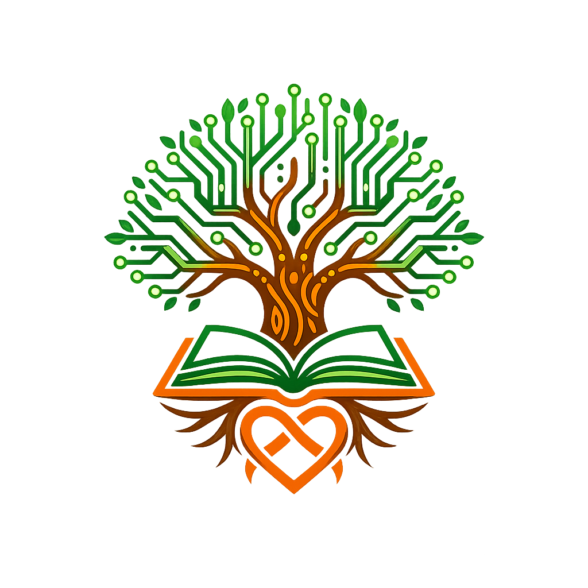

#  Yëkëni — African Family Genealogy Platform

<p align="center">
  
</p>

<p align="center">
  <em>"Se retrouver, se reconnaître"</em>
</p>

<p align="center">
  
  
  
  
  
  
</p>

---

## 📌 Contexte & Problématique

En Afrique, des millions de familles perdent chaque jour une partie de leur histoire. Les plateformes de généalogie étrangères comme **Ancestry.com** ou **23andMe** collectent et monétisent les données ADN et familiales des Africains sans consentement réel. Pendant ce temps, les langues locales s'éteignent et les jeunes de la diaspora ne connaissent plus leurs origines.

> *"Ancestry.com connaît mieux la généalogie africaine que les Africains eux-mêmes — Yëkëni est là pour changer ça."*

**Yëkëni** (mot Wolof signifiant **"se reconnaître"**) répond à ce défi avec une solution locale, souveraine et culturellement adaptée à la réalité africaine.

---

## 🎯 Problèmes résolus

| Problème | Solution Yëkëni |
|---|---|
| 🕵️ Espionnage culturel par plateformes étrangères | Données stockées localement, aucun serveur tiers |
| 🌍 Déracinement des Africains de la diaspora | Section "Mes Racines" avec villages, ethnies, langues |
| 📖 Disparition des traditions orales | Mémoire familiale avec traditions et histoire |
| 🗣️ Barrière linguistique | Support Français, Wolof, Pulaar, Sérère |
| 🩺 Perte des données médicales familiales | Fiche santé par membre |

---

## ✨ Fonctionnalités principales

### 🌳 Arbre Généalogique Interactif
> Visualisez et naviguez dans votre famille sur plusieurs générations

- Navigation par clic entre membres (père → grand-père → arrière-grand-père...)
- Ajout de père, mère, frères, sœurs, enfants, conjoint
- Modification et suppression de membres
- Upload de photos de profil
- Fil d'Ariane pour se repérer dans l'arbre
- Recherche de membres
- **Biographies générées par IA** (Claude Anthropic)
- Sauvegarde automatique

### 🌍 Mes Racines
> Documentez les origines culturelles de chaque ancêtre

- Origine ethnique (Peul, Wolof, Sérère, Mandingue, Diola...)
- Village et région d'origine
- Langues parlées avec ajout personnalisé
- Voix des anciens (témoignages audio)
- Visualisation des ethnies et langues de toute la famille

### 👥 Gestion des Membres
> Un profil complet pour chaque membre de la famille

- Informations personnelles : nom, profession, ville, pays
- Données de santé : groupe sanguin, allergies, maladies héréditaires
- Recherche et filtrage par nom, ville ou pays

### 📸 Mémoire Familiale
> Préservez l'histoire et les traditions pour les générations futures

- Souvenirs avec catégories (mariage, naissance, diplôme...)
- Traditions culturelles et religieuses
- Timeline interactive de l'histoire familiale
- Système de likes sur les souvenirs

### 🎂 Événements Familiaux
> Ne manquez plus aucun moment important

- Calendrier des événements avec icônes personnalisées
- Alertes automatiques (rouge si moins de 7 jours)
- Compteur de jours restants

### Autres fonctionnalités
| Fonctionnalité | Description |
|---|---|
| 💬 Chat familial | Messagerie entre membres |
| 🗺️ Carte mondiale | Localisation géographique de chaque membre |
| 📊 Statistiques | Analyses et visualisations de la famille |
| 🔑 Code famille | Accès sécurisé par code unique |
| 🩺 Santé familiale | Historique médical complet |

---

## 🛡️ Souveraineté & Sécurité des Données

| Engagement | Détail |
|---|---|
| ✅ Données locales | Stockées dans le navigateur (localStorage), jamais envoyées à l'étranger |
| ✅ Zéro monétisation | Aucune donnée vendue à des tiers |
| ✅ Accès sécurisé | Code famille unique pour chaque famille |
| ✅ Open Source | Code transparent et auditable par tous |
| ✅ Langues locales | Interface disponible en Wolof, Pulaar, Sérère |

---

## 🚀 Installation & Démarrage

### Prérequis
- [Node.js](https://nodejs.org/) >= 16
- npm >= 8

### Étapes

```bash
# 1. Cloner le projet
git clone https://github.com/gningueantou-sys/Y-k-ni.git

# 2. Aller dans le dossier frontend
cd Y-k-ni

# 3. Installer les dépendances
npm install

# 4. Lancer en développement
npm start
```

✅ L'application s'ouvre automatiquement sur [http://localhost:3000](http://localhost:3000)

---

## 📁 Structure du Projet
Y-k-ni/

└── src/

│

├── 🏠 App.js / App.css

│       Page d'accueil publique (hero, fonctionnalités, stats)

│

├── 🔐 Auth.js / Auth.css

│       Authentification — connexion, inscription, code famille

│

├── 🏡 Famille.js / Famille.css

│       Création d'une famille avec génération du code QR

│

├── 📊 Dashboard.js / Dashboard.css

│       Tableau de bord principal avec sidebar de navigation

│

├── 🌳 ArbreAnime.js / ArbreAnime.css

│       Arbre généalogique interactif — navigation, ajout, modification

│       Intègre l'IA pour générer des biographies automatiques

│

├── 👥 Membres.js / Membres.css

│       Liste et profils détaillés des membres de la famille

│

├── 🌍 Racines.js / Racines.css

│       Origines ethniques, villages, langues africaines

│

├── 📸 Memoire.js / Memoire.css

│       Souvenirs, traditions culturelles, histoire familiale

│

├── 🩺 Sante.js / Sante.css

│       Données médicales — groupes sanguins, maladies héréditaires

│

├── 🗺️ Carte.js / Carte.css

│       Carte mondiale interactive (Leaflet) des membres

│

├── 💬 Chat.js / Chat.css

│       Messagerie familiale interne

│

├── 📊 Statistiques.js / Statistiques.css

│       Graphiques et analyses (Recharts)

│

└── ⚙️ index.js / index.css

Point d'entrée de l'application React

---

## 🛠️ Stack Technique

| Technologie | Version | Usage |
|---|---|---|
| **React.js** | 18.x | Framework frontend principal |
| **Leaflet + React-Leaflet** | 4.x | Carte interactive mondiale |
| **Recharts** | 2.x | Graphiques et visualisations |
| **Claude AI (Anthropic)** | Sonnet | Génération de biographies IA |
| **localStorage** | — | Persistance des données en local |
| **CSS personnalisé** | — | Design, animations, thème africain |

---

## 🌍 Langues Supportées

| Langue | Code | Statut |
|---|---|---|
| 🇫🇷 Français | `fr` | ✅ Complet |
| 🇸🇳 Wolof | `wo` | ✅ Interface |
| 🇸🇳 Pulaar | `ful` | 🔄 En cours |
| 🇸🇳 Sérère | `srr` | 🔄 En cours |

---

## 🏆 Hackathons & Compétitions ciblés

| Compétition | Thème | Pertinence |
|---|---|---|
| 🏅 **AIMS Senegal Hackathon** | Innovation scientifique africaine | ⭐⭐⭐⭐⭐ |
| 🏅 **Hackathon iSAFE** | Souveraineté numérique & IA | ⭐⭐⭐⭐⭐ |
| 🏅 **ID4Africa Hackathon** | Identité numérique africaine | ⭐⭐⭐⭐⭐ |
| 🏅 **Orange Social Venture Prize** | Impact social en Afrique | ⭐⭐⭐⭐ |
| 🏅 **Dakar Digital Week** | Innovation tech au Sénégal | ⭐⭐⭐⭐ |

---

## 🗺️ Roadmap

- [x] Arbre généalogique interactif
- [x] Gestion des membres
- [x] Origines ethniques et culturelles
- [x] Mémoire familiale
- [x] Événements avec alertes
- [x] Biographies générées par IA
- [x] Sauvegarde localStorage
- [ ] Authentification réelle (backend)
- [ ] Synchronisation multi-appareils
- [ ] Application mobile (React Native)
- [ ] Export PDF de l'arbre
- [ ] Reconnaissance faciale par IA

---

## 👨‍💻 Développeur

**Pape Antou Gningue**
- 🎓 Étudiant en L1 Informatique
- 📍 Dakar, Sénégal
- 🌐 GitHub : [@gningueantou-sys](https://github.com/gningueantou-sys)

---

## 📄 Licence

Ce projet est sous licence **MIT** — voir le fichier [LICENSE](LICENSE) pour plus de détails.

---

<p align="center">
  <strong>Fait avec ❤️ au Sénégal · © 2025 Yëkëni</strong><br/>
  <em>Préservons ensemble l'héritage culturel africain</em>
</p>
